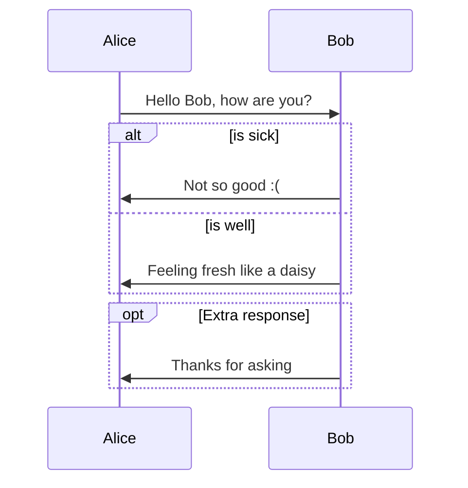
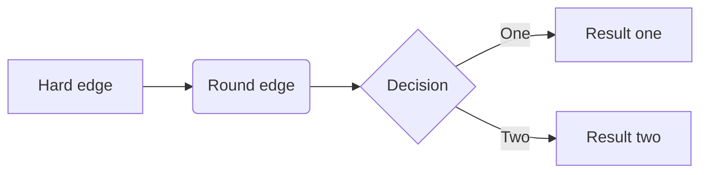

# tuneupfitness.com - Optimization plan 

| Source Documents | Description |
|  ---             | ---         |
|[Tune Up Fitness](https://docs.google.com/document/d/1sVt_LTZuUC4oRVdm-JtJKKmxvChiKv7m8JJDIbtFyco/edit?usp=sharing_eil&ts=67d0b7d6) | Website Functionality Outline - Feb 2025 |
|[External Contractor](https://docs.google.com/spreadsheets/d/15adcCApvYTC9nrZl_Da9Uvu8fZOMm_0YXEMZLFfvCsE/edit?usp=sharing_eil&ts=67d0a8f3) | WordPress Plugin Reference - Feb 2025 |

# Process Diagrams

