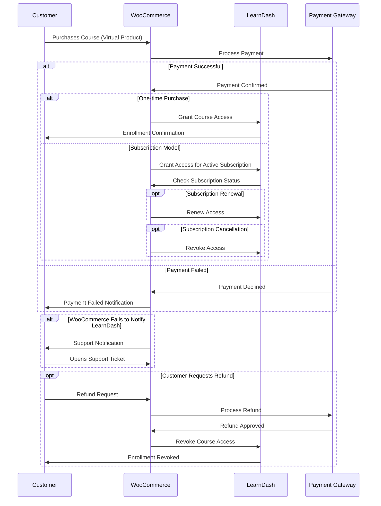

# [tuneupfitness.com](https://www.tuneupfitness.com) - Optimization plan 

| Prepared by | Version | Date |
| --- | ---| ---|
| Tomasz Kowalski | 1.00 | 13.03.2025 |

| Table of Contents |
| --- |
<!-- TOC -->
- [tuneupfitness.com - Optimization plan](#tuneupfitnesscom---optimization-plan)
  - [Project requirements](#project-requirements)
    - [Stage 1: Documentation \& Blueprint Creation](#stage-1-documentation--blueprint-creation)
    - [Stage 2: Optimization \& Improvement Recommendations](#stage-2-optimization--improvement-recommendations)
  - [Provided Documents](#provided-documents)
  - [Page Speed Insights Analysis](#page-speed-insights-analysis)
    - [Mobile Performance](#mobile-performance)
  - [Mockup Woocommerce Process Diagrams](#mockup-woocommerce-process-diagrams)
    - [Woocommerce and Learn Dash integration details](#woocommerce-and-learn-dash-integration-details)
<!-- /TOC --> 
## Project requirements

### Stage 1: Documentation & Blueprint Creation

| No | Objective |
| --- | ---|
| 1 | Conduct a full-site audit to map out plugin dependencies, integrations, and custom code. |
| 2 |  Categorize plugins and scripts based on their role in specific site modules. |
| 3 | Document WooCommerce and LearnDash integration details and dependencies. |
| 4 | Provide a structured, detailed report that serves as a technical handoff guide for future developers or identify redundancies and unnecessary plugin loads across different sections of the site agencies |

### Stage 2: Optimization & Improvement Recommendations

| No | Objective |
| --- | --- |
| 1 | Analyze opportunities for plugin/script consolidation, focusing on performance and efficiency.
| 2 | Suggest strategies to improve site speed, including database optimizations and script minimization.
| 3 | Identify better ways to structure plugin dependencies to improve site maintainability. | 

## Provided Documents

| Source Documents | Description |
|  ---             | ---         |
|[Tune Up Fitness](https://docs.google.com/document/d/1sVt_LTZuUC4oRVdm-JtJKKmxvChiKv7m8JJDIbtFyco/edit?usp=sharing_eil&ts=67d0b7d6) | Website Functionality Outline - Feb 2025 |
|[External Contractor](https://docs.google.com/spreadsheets/d/15adcCApvYTC9nrZl_Da9Uvu8fZOMm_0YXEMZLFfvCsE/edit?usp=sharing_eil&ts=67d0a8f3) | WordPress Plugin Reference - Feb 2025 |

## Page Speed Insights Analysis

### Mobile Performance

| URL | Date |Performance | LCP | FCP | CLS |
| --- | --- | --- | ---| --- | ---|
| [Homepage](https://pagespeed.web.dev/analysis/https-www-tuneupfitness-com/xzad5ozgcv?form_factor=desktop) | 13.03.2025 | 41/100|5.7s |4.4s |0.03|
| [Wholesale Shop](https://pagespeed.web.dev/analysis/https-www-tuneupfitness-com-shop-wholesale/fwny1aukws?form_factor=mobile)|13.03.2025|50/100 | 20.8s| 12.5s|0.137|

## Mockup Woocommerce Process Diagrams

### Woocommerce and Learn Dash integration details

